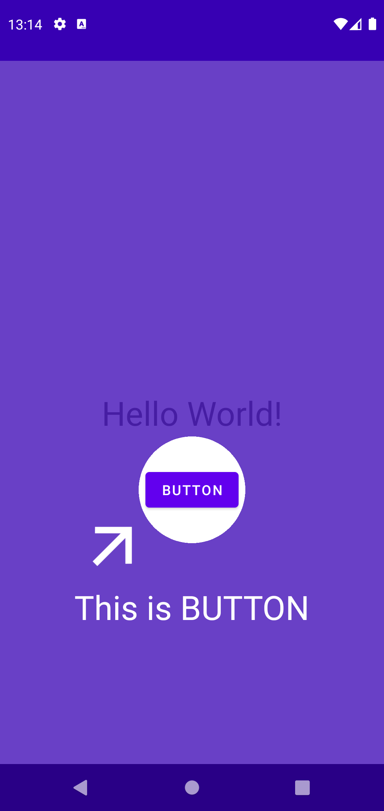

# Guide_UI

This is [Spotlight](https://github.com/TakuSemba/Spotlight) sample.

Spotlight is used to explain how to use the application.

- create Target objects
    - prepare a layout as overlay to explain specific component
- add Target objects to the Spotlight object
- do ```spotlight.start()``` to start animation



## Environment

- Android Studio Bumblebee | 2021.1.1 Patch 2
- targetSdk 31
- com.github.takusemba:spotlight:2.0.5
